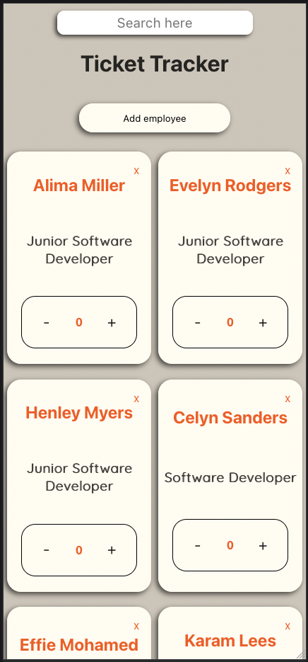
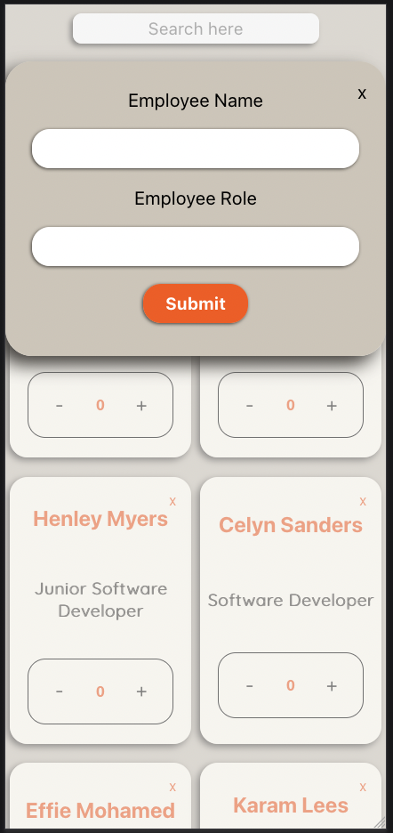

<h1 align="center">Ticket Tracker</h1>

---

 Just a simple Ticket Tracker made with React.
      

## 📝 Table of Contents

- [About](#about)
- [Getting Started](#getting_started)
- [Usage](#usage)
- [Screenshots](#screenshots)
- [Built Using](#built_using)
- [Author](#author)

## 📖 About 

Simple ticket tracker, which let's you track how many tickets each person has. It's possible to add new employees as well as delete them and search through them by both the name and the position.

## 🛠 Getting Started 

To open the website you need to download the repo, and then open terminal in the repo's folder. Run the following command: 
### `npm install`
to make it install every node modules you will need - npm will find it on it's own thanks to the dependencies. Once it's installed, you can run the command:
### `npm start`
and the app will be ready to see on the server.

Open [http://localhost:3000](http://localhost:3000) to view it in your browser.

## 🈠Usage 

- Press on either + or - to ascend/descend number by 1, it will work on each employee separately - even on the ones added later.
- Press "Add employee" button on top to add the new employee, you need to give both name and the role, as both are required, then press Sumbit button and it will close the adding employee window, and append the new employee to the screen (and also you can search for it later).
- If you open the window to add an employee but decide you don't want to add, just press the "X" and it will close the window.
- To remove an employee, press the "X" on it's card - works also when in search mode.
-To search for an employee just start typing either the position of the employee or the name, and it will start filtering the employees, if you delete everything from the search box - you will get the whole list back.

## 📸 Screenshots 

## ⛏️ Built Using 
React, JSX, CSS, SCSS, BEM

## ✍️ Author 
- [@DorBia](https://github.com/DorBia)
